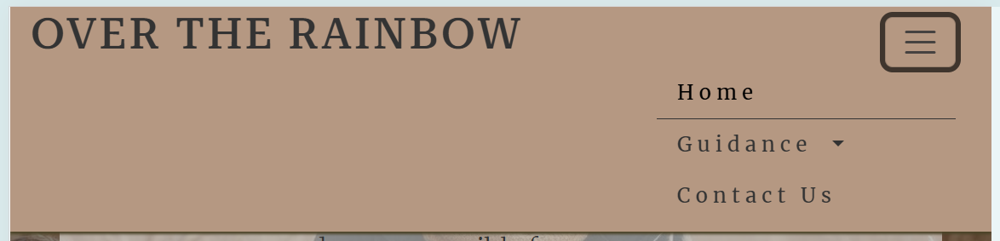

| <a href="https://majak02.github.io/Over-The-Rainbow/" target="_blank">Link to Project</a> |

# Over The Rainbow
Over the Rainbow is my first portfolio project developed as part of the Code Institute Full Stack Software Developer Bootcamp, consisting of learning outcomes to utilise HTML5, CSS3 & Bootstrap in order to fulfil the necessary requirements for the brief provided about Mental Health.

## Introduction
Welcome to Over the rainbow! Your go to, beginner-friendly website for all mental health rersources. This site hopes to be a starting point for anyone beginning the journey into mental  wellness; whether they are seeking treatments options,  infromation about current research & campaigns or wanting to get invovled in fundraising, over the rainbow aims to be the hub of all this current information in a beginner-friendly format. 

 

## UX Design

## User Stories 
As a user with attention difficulties, I want the website to have a clean, uncluttered design with clear headings and short paragraphs, so I can focus on the content without getting overwhelmed.

As a user, I can easily locate the contact us form so that I can get in touch with the service provided.

As a user with limited tech skills, I want intuitive navigation and clearly labeled buttons, so I can easily find the information I need without frustration.

As someone new to therapy, I want to see clear explanations of different types of mental health treatments, so I can make an informed decision about what might work best for me.

As someone unsure about seeking help, I want to read relatable stories from people who have benefited from mental health support, so I can feel more comfortable taking the next step.

## Colors

Color selection is key when it comes to enticing users to visit and remain on any website, and with mental health have so many inclusion and accesibility criteria, this color selection was of particular importance. 

To initially generate a color scheme idea, perplexity.ai was used to formulate some initial palettes. However after beginning the project, this color scheme was deemed lacking, and coolors (https://coolors.co/) was used to generate an appropriate color palette from my hero image. This resulted in an appropriate color scheme that is aesthetically pleasing, neutral whilst being both calming and engaging without overwhelming users. 

### Main Palette

--lion: #C29466ff;
--gray: #72797Eff;
--tan: #E0B993ff;
--dun: #E7CDB0ff;
--lion-2: #B59882ff;

While the main palette includes the above colors, in practice the project employed mainly:

--text-color: #333333; /* Dark grey */
--primary-color: #b59882; /* Light brown */
--background-color: #f8f9fa; /* Light grey */ 

## Fonts

As with color, font was a big consideration for ensuring a positive user experience whilst visiting the page. 
Three sans-serif fonts were selected for the project, and implemented via [Google Fonts](https://fonts.google.com) using a direct import code within the style.css file.

__Headings__
 
[Roboto Serif](https://fonts.google.com/specimen/Roboto+Serif) and [Montserrat](https://fonts.google.com/specimen/Prompt) serve as clear, readable fonts to be used within logos and headings.

__Body__
 
[Merriweather](https://fonts.google.com/specimen/Merriweather) Merriweather was designed to be a text face that is pleasant to read on screens and therefore incorporated as a font of choice for the body text.

## Features 

### Existing Features

- __Navigation Bar__

  - Featured on the homepage and contact us pages, the full responsive navigation bar includes links to the website text [logo] which when clicked returns the user back to the landing page, a direct Home page link, a contact us page and a guidance toggle link - which contains links directly to informative pages on Mind.org (Introduction to Mental Health, factors which may be impacting mental health and then a directro of currntly available treatment options). This navigation layout is identical on both the homepage and contact us page to allow for easy navigation.
  - I opted for a neutral, natural color scheme, in order to not overwhelm the users with bright colors or overwhelming information. 

- The dropdown button on the navbar was created using Bootstrap v5 Dropdowns (https://getbootstrap.com/docs/5.3/components/dropdowns/)

- __The landing page image__

  - The landing includes a photograph of a woman with text overlay to allow the user to see exactly what information this website applies to. Below the text I've included an 'Urgent Help?' button to immedietly offer a link to urgent support should they need it (Samaritans website). 
  

__Quote Section__
- Inspired by the official Mind.org website, I also included a quote section as an optical breakpoint/separation between the hero section and the included cards containing information and linkns to other resources/pages.
- This was created using Bootstrap v5 typography [blockquotes] (https://getbootstrap.com/docs/5.3/content/typography/#blockquotes)

__Advice Cards__
- Using Bootstrap v5 card design components (https://getbootstrap.com/docs/5.3/components/card/), I opted for a simpler design [plain white box with text only] due to the hero image already creating enough visual representation and color for the landing page - any more would be slightly too overwhelming for users, particularly those with sensitivity.
- I did alter the link buttons to be icons rather than text to 1. add creativity to the page and 2. reduce the amount of text within the cards from making it look cluttered. Utilizing a simpler, lined design icon (airplane icon from Font Awesome) remains as a clear, explicit icon encouraging users to click it without using block-like buttons.

- __The Footer__ 

  - The footer section includes links to the relevant social media sites for 'Over The Rainbow'. The links will open to a new tab to allow easy navigation for the user and icons (used from font awesome) reflect the associated social media logo, ensuring easy navigation. 

### Contact Us page

 __Landing page__

 For the contact us page, I implemented an alternative hero design - the image being on the right hand side and the text opposite. This was in line with the user story board expectations of an easily navigatable, clean designed website. 
 

 __Contact Us cards__

 For the contact us page, I opted to use cards with images rather than text only. This is aimed to help direct users and catch their attention when it came to seeking specific support. 

 

## Testing 

Testing and validation of this website was carried out throughout the course of the project.

This included regular debugging and testing using the Dev Tools provided within Chrome Browser, utilizing Copilot & Perplexity.ai alongside using validation testing to address any code lines which needed fixing.

### Validator Testing 

- HTML
  - No errors were returned when passing my code through the official W3C validator(https://validator.w3.org/nu/?showsource=yes&doc=https%3A%2F%2Fmajak02.github.io%2FOver-The-Rainbow%2F#l72c36)
 

  
- CSS
  - one error was found when passing through the official [(Jigsaw) validator](https://jigsaw.w3.org/css-validator/validator?uri=https%3A%2F%2Fmajak02.github.io%2FOver-The-Rainbow%2F&profile=css3svg&usermedium=all&warning=1&vextwarning=&lang=en) - namely a parse error for my hero image, however this remians unresolved as I could not debug this due to time constraints. 
 
  ### Lighthouse testing
Official lighthouse testing of my site revealed a 97% performance score with a 93% accessibility score.

  

### Unfixed Bugs

This project experienced some unresolved bugs regarding the navbar dropdown button ('Guidance'). 

__Navigation Dropdown__ 
  The navigation dropdown button appears to work as intended on the tablet size. While the navbar is responsive across all devices, the dropdown remains white, rather than being the color of the navbar (light brown) and it slightly extends beyond the screen size, cutting of the right hand size of the dropdown box. 

  - I have attempted to debug this issue using copilot, perplexity.ai and Chrome Devtools, however at this moment in time it remains unresolved. 

## Deployment

This GitHub project was created using the Code Institute Template ensuring all necessary extensions were included when opening within the designated workspace on the Gitpod Desktop IDE.

- The site was deployed to GitHub pages. The steps to deploy are as follows:

- In the GitHub repository, navigate to the Settings tab
- From the source section drop-down menu, select the Master Branch ['Main']
- Once the master branch has been selected, the page will be automatically refreshed with a detailed ribbon display to indicate the successful deployment.

The live website for this project can be found at: https://majak02.github.io/Over-The-Rainbow/ 

Additional information on the deployment process can be found on the official GitHub Docs

## Credits 
__Code and Content__
Project and primary learning supplied by Code Institute

Supplemental learning resources directly used / referenced within the project:
- Bootstrap 5 Docs
- CSS Variables - The var() function
- The text for the home and contact us pages hero section was generated and adapted from perplexity.ai, as well as being used as a debugging tool.
- Code Institute Boardwalk games and Love Running walkthrough code used to as a basis for this project.
- Mind, Samaritans, Mental Health Foundation, Shout, Rethink and FearFree were all used to provide information on resources, support and existing mental health guidelines used within the website and its associated links.

### Media

- Hero images on both the Home and contact us pages and all card images were created by Freepik (https://www.freepik.com/)
- The icons in the footer and for the card buttons were taken from [Font Awesome](https://fontawesome.com/)
- Favicon was generated from iconify (https://iconify.design/)
- Fonts used were generated by Perplexity.ai and incorporated through Google Fonts (https://fonts.google.com/)

